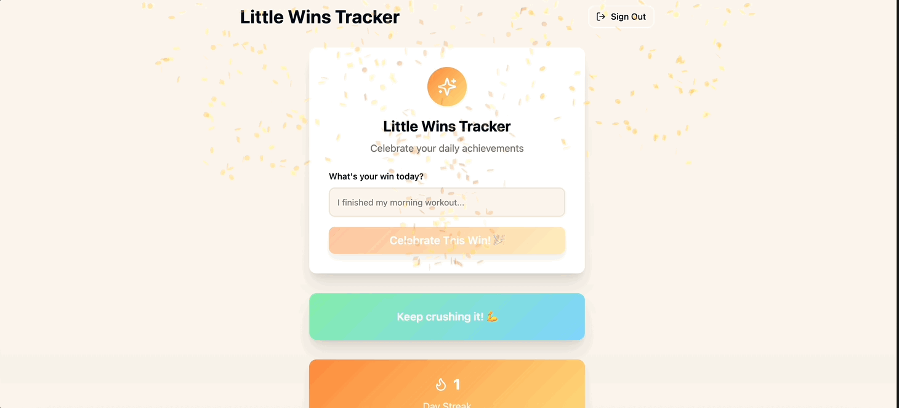

# Daily Wins Tracker 🎉

A gamified personal achievement tracking application that helps users celebrate their daily wins with streaks, confetti animations, and motivational messages. Built with React, TypeScript, and Supabase.

**🚀 Live Demo**: https://daily-win-sparkle.lovable.app/auth

## Demo



*Add wins, celebrate with confetti, and track your daily achievements!*

## Features

- 🔐 **Secure Authentication**: Google OAuth and email/password login
- 🎯 **Win Tracking**: Add and manage daily achievements
- 🔥 **Streak System**: Track consecutive days of logging wins
- 🎊 **Celebrations**: Confetti animations and motivational messages
- 📱 **Responsive Design**: Works on desktop and mobile
- 🔒 **Data Privacy**: Complete user data isolation with RLS

## Tech Stack

### Frontend
- **React 18** with TypeScript
- **Vite** for build tooling and development
- **React Query** (@tanstack/react-query) for server state management
- **React Hook Form + Zod** for form validation

### Backend & Database
- **Supabase** for authentication and database
- **PostgreSQL** with Row Level Security (RLS)

### Authentication
- **Google OAuth 2.0** (production-ready)
- **Email/password** authentication

## Architecture

### Application Structure
```
src/
├── components/          # React components
│   ├── ui/             # shadcn/ui components (auto-generated)
│   ├── WinInput.tsx    # Win entry form with validation
│   ├── WinHistory.tsx  # Win display with streak calculation
│   └── MotivationalMessage.tsx # Celebration messages
├── hooks/              # Custom React hooks
│   ├── useAuth.tsx     # Authentication state management
│   ├── useWins.tsx     # Win CRUD operations
│   └── useLocalStorage.ts # Local storage utilities
├── pages/              # Route components
│   ├── Index.tsx       # Main dashboard (protected route)
│   ├── Auth.tsx        # Login/signup page
│   └── NotFound.tsx    # 404 page
├── integrations/
│   └── supabase/       # Supabase client and TypeScript types
└── utils/              # Utility functions
    └── confetti.ts     # Celebration animations
```

### Component Architecture Decisions

#### 1. **Authentication-First Design**
- Protected routes redirect unauthenticated users to `/auth`
- Context API provides global auth state
- Automatic token refresh and session management

#### 2. **Custom Hooks Pattern**
- `useAuth`: Centralized authentication logic
- `useWins`: Win CRUD operations with React Query integration
- `useLocalStorage`: Persistent local state management

#### 3. **UI Component Library**
- **shadcn/ui** chosen for:
  - Type-safe components with TypeScript
  - Accessible by default (Radix UI)
  - Customizable with Tailwind CSS

#### 4. **State Management Strategy**
- **Server State**: React Query for API calls, caching, and synchronization
- **Global State**: Context API for authentication
- **Local State**: React hooks for component-specific state
- **Form State**: React Hook Form for complex forms with validation

## Security Implementation

### Row Level Security (RLS)
Complete data isolation between users using PostgreSQL RLS policies:

**Security Features:**
- **Data Isolation**: Users can only access their own wins and profile
- **SQL Injection Protection**: Parameterized queries and RLS policies
- **Authentication**: JWT tokens with automatic refresh
- **Authorization**: Fine-grained permissions per operation (SELECT, INSERT, UPDATE, DELETE)
- **Secure Functions**: Database functions use `SECURITY DEFINER` with proper `search_path`

## Local Development

### Prerequisites
- **Node.js 18+** and npm
- **Git** for cloning the repository
- **Modern web browser** (Chrome, Firefox, Safari, Edge)

### Step-by-Step Setup

#### 1. Clone and Install
```bash
# Clone the repository
git clone https://github.com/kalpalathika/daily-win-sparkle.git
cd daily-win-sparkle

# Install dependencies
npm install
```

#### 2. Start Development Server
```bash
# Start the development server
npm run dev
```

The application will be available at **http://localhost:8080**

#### 3. Test the Application

**Authentication Flow:**
1. Navigate to `http://localhost:8080`
2. You'll be redirected to the auth page since you're not logged in
3. Choose either:
   - **Google Sign-In**: Click "Continue with Google" (requires Google OAuth setup)
   - **Email Sign-Up**: Click "Don't have an account? Sign up" and create an account


### Environment Configuration
The Supabase client is configured in `src/integrations/supabase/client.ts` with:
- Project URL: `https://qboobvzuylscjlxqtnfr.supabase.co`
- Anonymous key for client-side authentication
- Local storage for session persistence

## Database Migrations

Database schema is managed through Supabase migrations in `supabase/migrations/`:
- `20250813015540-.sql`: Initial schema with RLS policies
- `20250813015555-.sql`: Security improvements for functions


